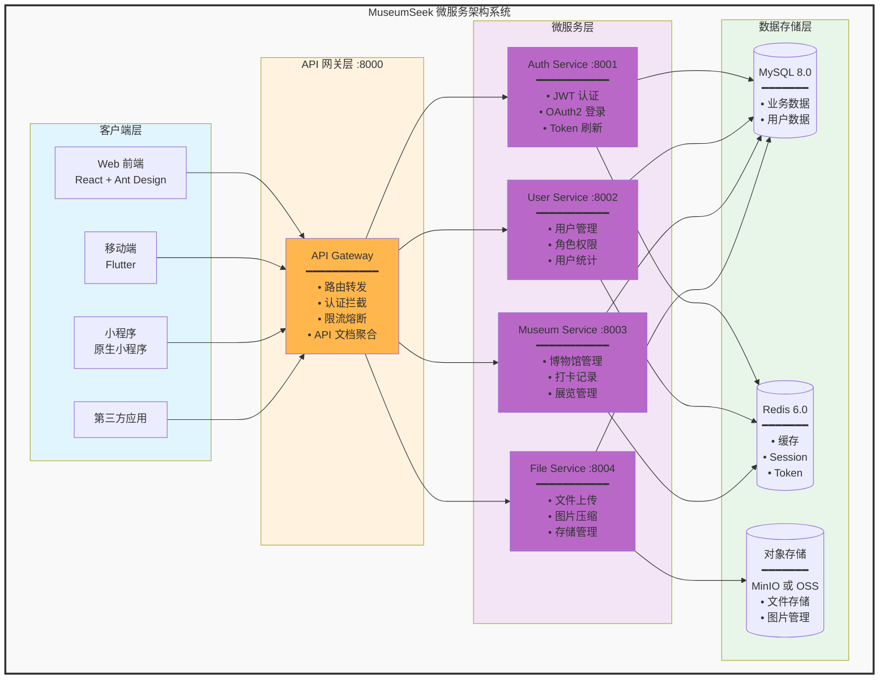

# MSeek-admin-backend 管理后台后端

<div align="center">

**基于 Spring Boot 3.x + Spring Cloud 的微服务架构后端系统**

探索身边的文化宝藏 · 记录每一次博物馆之旅

[](https://spring.io/projects/spring-boot)
[](https://spring.io/projects/spring-cloud)
[](https://www.oracle.com/java/)
[](https://baomidou.com/)
[](./LICENSE)

</div>

---

## 📋 项目简介

**MSeek-admin-backend 管理后台后端** 是一个基于微服务架构的博物馆数字化管理平台后端系统，采用 Spring Boot 3.x + Spring Cloud 技术栈，提供完整的博物馆信息管理、用户认证授权、文件存储、打卡审核等核心功能。

### ✨ 核心特色

- 🏗️ **微服务架构**: 服务解耦，独立部署，弹性扩展
- 🔐 **安全认证**: RS256 JWT + OAuth2 第三方登录
- 📊 **数据管理**: MyBatis Plus + Flyway 数据库版本管理
- 📁 **文件存储**: 支持 MinIO、阿里云 OSS 多种存储方式
- 📚 **API 文档**: Knife4j 自动生成 API 文档和调试界面
- 🚀 **高性能**: Redis 缓存 + Druid 连接池优化

### 系统架构



## 📋 模块说明

### api-gateway (网关服务)

#### api-service
API 接口定义模块，包含所有服务的 API 接口定义

**功能**:
- 提供统一的 API 接口定义
- Feign 客户端接口
- DTO 数据传输对象

#### gateway-service
API 网关服务，提供统一的入口和路由转发

**端口**: 8000  
**职责**:
- 请求路由和转发
- 统一认证拦截
- 跨域处理 (CORS)
- API 文档聚合 (Knife4j)
- 限流熔断

### auth-center (认证中心)

#### auth-service
认证授权服务，负责用户认证和权限管理

**端口**: 8001  
**职责**:
- 用户登录认证（账号密码、手机验证码）
- JWT Token 生成和验证 (RS256 算法)
- OAuth2 第三方登录（微信、支付宝）
- Token 刷新机制
- RBAC 权限控制

**数据库**: `mseek_auth`

### business-service (业务服务)

#### museum-service
博物馆核心业务服务

**端口**: 8003  
**职责**:
- 博物馆信息管理（增删改查、分类、标签）
- 展览信息管理
- 打卡记录管理
- 成就系统
- 公告管理
- Banner 管理
- 用户反馈管理
- 区域管理（省市区街道）
- 审核系统集成

**数据库**: `mseek_museum`

**主要 Controller**:
- `MuseumInfoController` - 博物馆信息管理（增删改查、分类、标签、Logo）
- `MuseumExhibitionController` - 展览管理（展览信息、时间管理）
- `CheckinRecordController` - 打卡记录管理（审核、统计、导出）
- `MiniAppMuseumController` - 小程序博物馆接口
- `AnnouncementController` - 公告管理（发布、编辑、启用状态）
- `BannerController` - Banner 管理（轮播图、排序、上下架）
- `FeedbackController` - 用户反馈管理
- `AreaProvinceController` / `AreaCityController` / `AreaDistrictController` / `AreaStreetController` - 区域管理
- `FileBusinessRelationController` - 文件业务关联管理
- `AppVersionController` - 移动端版本管理

#### user-service
用户业务服务

**端口**: 8002  
**职责**:
- 用户信息管理
- 角色管理
- 权限管理
- 用户打卡统计
- 用户收藏管理

**数据库**: `mseek_user`

### common-libs (公共库)

#### common-core
核心公共库，提供通用功能

**功能**:
- 通用工具类 (StringUtils, DateUtils, etc.)
- 常量定义
- 异常定义
- 统一响应结构 (Result)
- 分页封装

#### common-web
Web 公共库，提供 Web 相关通用功能

**功能**:
- 全局异常处理
- 统一认证拦截器
- CORS 跨域配置
- Swagger/Knife4j 配置
- 请求日志记录
- 参数校验

### common-service (公共服务)

#### file-service
文件管理服务

**端口**: 8004  
**职责**:
- 文件上传（支持多种存储）
- 文件下载
- 图片压缩
- 文件元数据管理

**支持的存储**:
- 阿里云 OSS
- MinIO
- 本地文件系统

**数据库**: `mseek_file`

## 🚀 快速开始

### 环境要求

- Java 17+
- Maven 3.6+
- MySQL 8.0+
- Redis 6.0+

### 本地开发

1. **启动依赖服务**
```bash
# 启动 MySQL 和 Redis
cd ../mseek-deploy
docker-compose up -d mysql redis
```

2. **配置数据库**
```bash
# 导入数据库脚本
mysql -u root -p < ../mseek-deploy/services/common/mysql/init/init-databases.sql
```

3. **启动服务**
```bash
# 按顺序启动
# 1. 认证中心
cd auth-center
mvn spring-boot:run

# 2. 业务服务
cd ../business-service
mvn spring-boot:run

# 3. API 网关
cd ../api-gateway
mvn spring-boot:run
```

### 构建部署

```bash
# 打包所有模块
mvn clean package -DskipTests

# 构建 Docker 镜像
mvn spring-boot:build-image
```

## 📁 项目结构

```
mseek-admin-backend/
├── api-gateway/                        # API 网关模块
│   ├── api-service/                   # API 接口定义
│   │   ├── src/main/java/
│   │   │   └── com/lynn/museum/api/
│   │   │       ├── client/            # Feign 客户端
│   │   │       └── dto/               # 数据传输对象
│   │   └── pom.xml
│   ├── gateway-service/               # 网关服务 (端口: 8000)
│   │   ├── src/main/java/
│   │   │   └── com/lynn/gateway/
│   │   │       ├── config/            # 配置类
│   │   │       ├── filter/            # 网关过滤器
│   │   │       └── handler/           # 处理器
│   │   ├── src/main/resources/
│   │   │   ├── application.yml
│   │   │   └── application-dev.yml
│   │   └── pom.xml
│   └── review-api/                    # 审核 API (预留)
├── auth-center/                        # 认证授权中心
│   └── auth-service/                  # 认证服务 (端口: 8001)
│       ├── src/main/java/
│       │   └── com/lynn/auth/
│       │       ├── controller/        # 认证控制器
│       │       ├── service/           # 认证服务
│       │       ├── security/          # 安全配置
│       │       ├── oauth2/            # OAuth2 配置
│       │       └── jwt/               # JWT 工具
│       ├── src/main/resources/
│       │   ├── application.yml
│       │   └── db/migration/          # Flyway 数据库迁移
│       └── pom.xml
├── business-service/                   # 业务服务模块
│   ├── museum-service/                # 博物馆服务 (端口: 8003)
│   │   ├── src/main/java/
│   │   │   └── com/lynn/museum/info/
│   │   │       ├── controller/        # 控制器层
│   │   │       ├── service/           # 业务逻辑层
│   │   │       │   └── impl/          # 实现类
│   │   │       ├── mapper/            # MyBatis Mapper
│   │   │       ├── entity/            # 实体类
│   │   │       ├── dto/               # DTO 对象
│   │   │       ├── vo/                # VO 对象
│   │   │       ├── config/            # 配置类
│   │   │       └── enums/             # 枚举类
│   │   ├── src/main/resources/
│   │   │   ├── application.yml
│   │   │   ├── mapper/                # MyBatis XML
│   │   │   └── db/migration/          # Flyway 迁移脚本
│   │   └── pom.xml
│   └── user-service/                  # 用户服务 (端口: 8002)
│       ├── src/main/java/
│       │   └── com/lynn/user/
│       │       ├── controller/
│       │       ├── service/
│       │       ├── mapper/
│       │       └── entity/
│       ├── src/main/resources/
│       │   ├── application.yml
│       │   └── db/migration/
│       └── pom.xml
├── common-libs/                        # 公共库模块
│   ├── common-core/                   # 核心公共库
│   │   ├── src/main/java/
│   │   │   └── com/lynn/common/core/
│   │   │       ├── constant/          # 常量定义
│   │   │       ├── exception/         # 异常定义
│   │   │       ├── result/            # 统一响应
│   │   │       ├── utils/             # 工具类
│   │   │       └── domain/            # 通用领域对象
│   │   └── pom.xml
│   └── common-web/                    # Web 公共库
│       ├── src/main/java/
│       │   └── com/lynn/common/web/
│       │       ├── config/            # Web 配置
│       │       ├── interceptor/       # 拦截器
│       │       ├── filter/            # 过滤器
│       │       ├── handler/           # 全局异常处理
│       │       └── aspect/            # 切面
│       └── pom.xml
├── common-service/                     # 公共服务模块
│   └── file-service/                  # 文件服务 (端口: 8004)
│       ├── src/main/java/
│       │   └── com/lynn/file/
│       │       ├── controller/        # 文件控制器
│       │       ├── service/           # 文件服务
│       │       ├── storage/           # 存储实现
│       │       │   ├── minio/         # MinIO 实现
│       │       │   ├── oss/           # OSS 实现
│       │       │   └── local/         # 本地存储
│       │       └── config/            # 配置类
│       ├── src/main/resources/
│       │   └── application.yml
│       └── pom.xml
├── docs/                               # 项目文档
│   ├── auth-redesign-plan.md          # 认证系统重构方案
│   ├── auth-system-comparison.md      # 认证系统对比
│   ├── feign-client-usage-example.md  # Feign 使用示例
│   ├── feign-error-handling-guide.md  # Feign 错误处理
│   ├── unified-auth-usage-guide.md    # 统一认证使用指南
│   └── 公告管理启用状态字段实施方案.md
├── logs/                               # 日志目录
└── pom.xml                             # 父 POM 配置
```

## 🔧 配置说明

### 环境配置

支持多环境配置：
- `application.yml` - 基础配置
- `application-dev.yml` - 开发环境
- `application-prod.yml` - 生产环境

### 关键配置项

```yaml
# 数据库配置
spring:
  datasource:
    url: jdbc:mysql://localhost:3306/mseek_museum
    username: root
    password: ${DB_PASSWORD}

# Redis 配置
spring:
  redis:
    host: localhost
    port: 6379
    password: ${REDIS_PASSWORD}

# JWT 配置
jwt:
  private-key: ${JWT_PRIVATE_KEY}
  public-key: ${JWT_PUBLIC_KEY}
```

## 🧪 测试

```bash
# 运行单元测试
mvn test

# 运行集成测试
mvn verify -P integration-test

# 生成测试覆盖率报告
mvn jacoco:report
```

## 📚 API 文档

启动服务后访问：
- Swagger UI: http://localhost:8000/doc.html
- OpenAPI: http://localhost:8000/v3/api-docs

## 🔧 技术栈

### 后端技术

| 技术 | 说明 | 版本 |
|-----|------|------|
| Spring Boot | 企业级应用框架 | 3.0.2 |
| Spring Cloud | 微服务框架 | 2022.0.1 |
| Java | 编程语言 | 17 |

### 核心能力

- **微服务架构**: Spring Cloud + Nacos 服务注册与配置
- **数据持久化**: MyBatis Plus 3.5.3.1 + Flyway 数据库版本管理
- **缓存加速**: Redis 6.0+ 缓存和会话存储
- **认证授权**: JWT RS256 + OAuth2 第三方登录
- **文件存储**: MinIO 8.5.7 + 阿里云 OSS
- **API 文档**: Knife4j 4.4.0 自动生成和调试
- **开发工具**: Lombok + Hutool + Maven

## 📝 开发规范

### 命名规范

| 类型 | 规范 | 示例 |
|-----|------|------|
| 类 | PascalCase | `MuseumInfoController` |
| 方法 | camelCase | `getMuseumById` |
| 常量 | UPPER_SNAKE_CASE | `DEFAULT_CHARSET` |
| 数据库表 | 小写下划线 | `ms_museum_info` |
| 数据库字段 | 小写下划线 | `create_time` |

### 代码规范

- ✅ 遵循 **阿里巴巴 Java 开发手册**
- ✅ 使用 **Lombok** 简化代码（@Data, @Builder, @Slf4j）
- ✅ 统一异常处理（GlobalExceptionHandler）
- ✅ 完整的 **JavaDoc** 注释
- ✅ 标准分层架构（Controller → Service → Mapper → Database）

### API 接口规范

```bash
# RESTful 风格
GET    /api/v1/museums/{id}      # 获取单个
GET    /api/v1/museums           # 获取列表
POST   /api/v1/museums           # 创建
PUT    /api/v1/museums/{id}      # 更新
DELETE /api/v1/museums/{id}      # 删除
```

### 提交规范

```bash
# 功能开发
git commit -m "feat: 添加博物馆管理功能"

# Bug 修复
git commit -m "fix: 修复用户登录问题"

# 文档更新
git commit -m "docs: 更新 API 文档"

# 代码重构
git commit -m "refactor: 重构认证服务"
```

## 🐛 常见问题

### 1. 服务启动失败

**问题**: 服务启动时报错

**解决方案**:
```bash
# 检查 MySQL 是否运行
docker ps | grep mysql

# 检查 Redis 是否运行
docker ps | grep redis

# 查看服务日志
tail -f logs/museum-service.log

# 检查端口占用
lsof -i :8000  # 网关端口
lsof -i :8001  # 认证服务端口
lsof -i :8002  # 用户服务端口
lsof -i :8003  # 博物馆服务端口
```

### 2. 数据库连接失败

**问题**: `Cannot connect to database` 或 `Access denied`

**解决方案**:
1. 检查数据库配置 `application.yml`
2. 确认数据库是否已创建
3. 检查用户名密码是否正确
4. 确认数据库服务是否启动

```bash
# 测试数据库连接
mysql -h localhost -u root -p

# 查看数据库
SHOW DATABASES;

# 创建数据库（如果不存在）
CREATE DATABASE mseek_museum;
CREATE DATABASE mseek_user;
CREATE DATABASE mseek_auth;
CREATE DATABASE mseek_file;
```

### 3. JWT 验证失败

**问题**: Token 验证失败或过期

**解决方案**:
1. 检查 JWT 密钥配置是否正确
2. 确认公钥私钥是否匹配
3. 检查 Token 是否过期
4. 查看 `config/keys/` 目录下的密钥文件

```bash
# 查看密钥文件
ls -la ../config/keys/

# 重新生成密钥（如果需要）
openssl genrsa -out jwt_private_key.pem 2048
openssl rsa -in jwt_private_key.pem -pubout -out jwt_public_key.pem
```

### 4. Flyway 迁移失败

**问题**: 数据库迁移脚本执行失败

**解决方案**:
```bash
# 查看 Flyway 历史
SELECT * FROM flyway_schema_history;

# 清理 Flyway 历史（谨慎使用）
mvn flyway:clean

# 重新执行迁移
mvn flyway:migrate
```

### 5. 文件上传失败

**问题**: 文件上传返回错误

**解决方案**:
1. 检查 MinIO 服务是否启动
2. 确认存储配置是否正确
3. 检查文件大小是否超过限制
4. 查看文件服务日志

```bash
# 检查 MinIO 服务
curl http://localhost:9000/minio/health/live

# 查看文件服务配置
cat common-service/file-service/src/main/resources/application.yml
```

### 6. Feign 调用失败

**问题**: 服务间调用失败

**解决方案**:
1. 检查目标服务是否启动
2. 确认服务注册是否成功
3. 查看 Feign 配置和超时设置
4. 参考文档：`docs/feign-error-handling-guide.md`

### 7. Maven 依赖下载失败

**问题**: 依赖下载缓慢或失败

**解决方案**:
```bash
# 使用阿里云镜像
# 编辑 ~/.m2/settings.xml，添加：
<mirror>
  <id>aliyun</id>
  <mirrorOf>central</mirrorOf>
  <name>Aliyun Maven</name>
  <url>https://maven.aliyun.com/repository/public</url>
</mirror>

# 清理并重新下载
mvn clean install -U
```

## 相关文档

### 项目文档

- **API 文档**: http://localhost:8000/doc.html

### 外部资源

| 资源 | 链接 | 说明 |
|-----|------|------|
| Spring Boot 官方文档 | [查看](https://spring.io/projects/spring-boot) | Spring Boot 开发指南 |
| MyBatis Plus 文档 | [查看](https://baomidou.com/) | ORM 框架文档 |
| Knife4j 文档 | [查看](https://doc.xiaominfo.com/) | API 文档工具 |
| Spring Cloud 文档 | [查看](https://spring.io/projects/spring-cloud) | 微服务框架 |

---

## 🤝 贡献指南

欢迎贡献代码、提出问题和建议！

### 贡献流程

1. Fork 本仓库
2. 创建特性分支 (`git checkout -b feature/AmazingFeature`)
3. 提交更改 (`git commit -m 'feat: 添加某个功能'`)
4. 推送到分支 (`git push origin feature/AmazingFeature`)
5. 提交 Pull Request

### 问题反馈

- 🐛 **Bug 反馈**: [提交 Issue](https://github.com/zketer/mseek-admin-backend/issues)
- 💡 **功能建议**: [提交 Issue](https://github.com/zketer/mseek-admin-backend/issues)
- 💬 **技术讨论**: [GitHub Discussions](https://github.com/zketer/mseek-admin-backend/discussions)

---

## 👥 开发团队

- **项目维护**: zlynn
- **联系邮箱**: museumseek@163.com
- **GitHub**: [@zketer](https://github.com/zketer)

---

## 📄 开源协议

本项目采用 MIT 许可证 - 详见 [LICENSE](./LICENSE) 文件

---

<div align="center">

**MSeek 博物馆管理后台**

探索文化 · 记录足迹 · 分享美好

Made with ❤️ by zlynn

---

**最后更新**: 2025-12-03  
**当前版本**: v0.0.1

</div>
